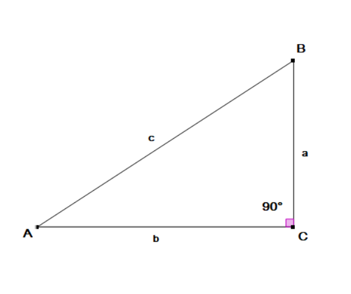
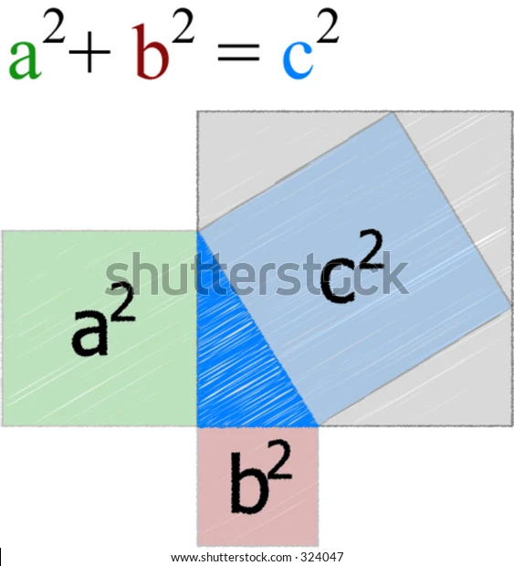

## Pisagor Teoremi İspatı
Bu yazımda geometri konularından aşina olduğumuz Pisagor Teoremi'nin matematiksel ispatını sezgisel yollarla anlatmaya çalışacağım.

 

### Nedir Bu Pisagor Teoremi?
Pisagor Teoremi basitçe bir dik üçgenin hipotenüsünün hesaplanmasıdır. Yani diğer iki kenarı kullanarak en uzun kenarı hesaplarız. Bunu yaparken de üçgenin diğer kenarlarını kullanırız.
- Dik Üçgen: Bir kenarı 90 derece olan üçgen.
- Hipotenüs: Dik üçgenin karşısındaki kenar.
 

### Matematiksel Yazım
Pisagor Teoremi'nin matematiksel yazımı şu şekilde: $a^2 + b^2 = c^2$

### İspat
İspatı için en bilinen üçgenlerden birini (3-4-5 üçgeni) kullanalım.
1. a = 3
2. b = 4
3. c = 5

olmak üzere. bu sayıların karelerini alacağız.
1. $a^2 =$&nbsp;&nbsp;&nbsp;&nbsp;  $9$
2. $b^2 =$&nbsp;&nbsp;&nbsp;&nbsp; $16$
3. &nbsp;&nbsp;&nbsp;&nbsp; +__________
4. $c^2 =$&nbsp;&nbsp;&nbsp;&nbsp; $25$

değerlerini elde etmiş olduk, böylelikle formülümüz sağlanmış oldu. c'nin değerini bulduk. $c^2 = 25 => c=5$
aşağıda ise görselleştirilmiş hali var:

